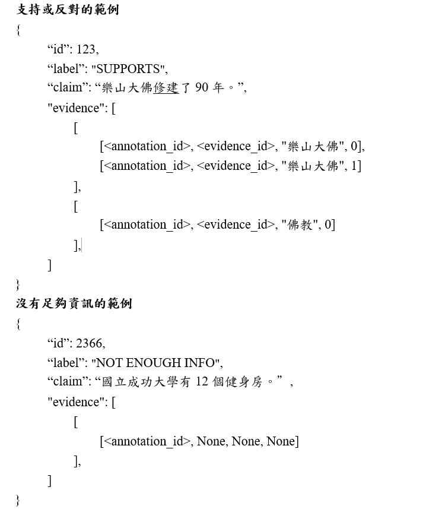
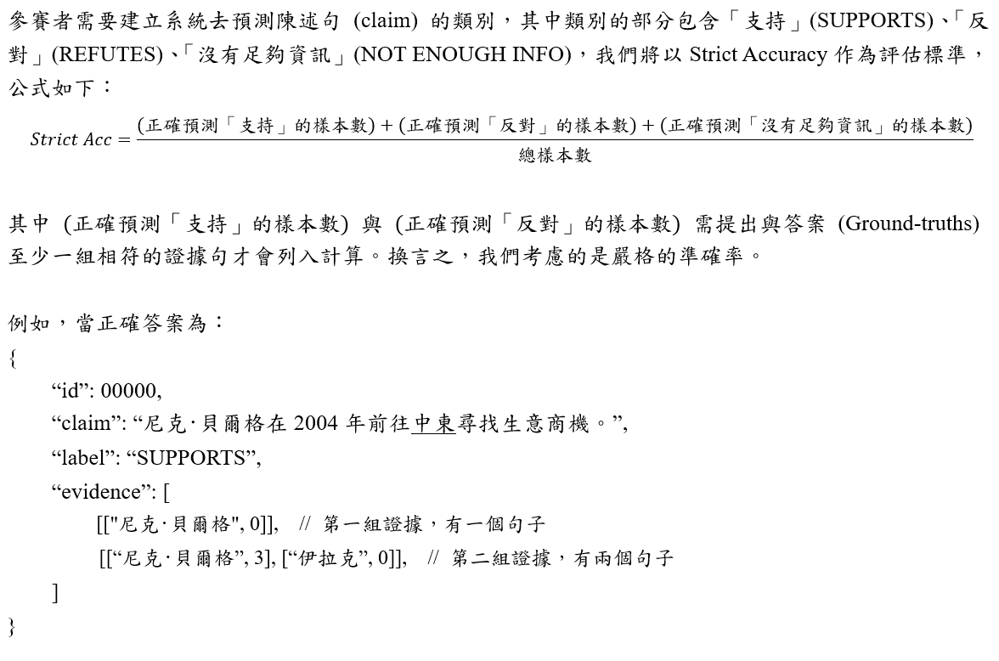

# AICUP-2023-Fact-Extraction-and-Verification-for-Disinformation

* TEAM_3517 
* Private leaderboard：0.680223 / Rank 6
* Environment: Colab Pro
    * GPU: NVIDIA A100-SXM4-40GB
 * [Download checkpoints](https://drive.google.com/file/d/12m8aVyHx8xZNr6A6dSZQXQDj_Q8-xVfW/view?usp=sharing)

## Install Package
```bash
pip install -r requirements.txt
```

## Data format 

The files provided for download for participants are divided into three main categories: 
* Training datasets, including "Chinese Wikipedia data" and "public training dataset"
* Public test dataset 
* Private test dataset

The descriptions are as follows:

1. Chinese Wikipedia data (archived version: Dec 2022 dump):

    * The format is .jsonl and has been split into multiple files, with each file containing 50,000 processed entries.
    * Each row represents an entry, which corresponds to an article in Wikipedia.
    * The "id" field represents the article name, the "text" field represents the processed article, and the "lines" field represents the original Wikipedia data.
2. Public training dataset: The downloaded file is named public_train.jsonl, and the data content includes:

    * Each row represents a claim sentence and its correct answer.
    * The information in each row includes "id": sample ID, "label": validation category of the claim sentence, "claim": claim sentence text, and "evidence": evidence set.
    * The format of "evidence" is [<annotation_id>, <evidence_id>, article name, sentence number], which is composed of multiple layers of lists. It represents that a claim sentence may have multiple sets of evidence, and each set of evidence may contain multiple evidence sentences (which can be observed in the innermost list of the dataset). If a set of evidence contains multiple evidence sentences, they will have the same <evidence_id>. Each evidence sentence in a set shares the same <annotation_id>, and if the "label" of a claim sentence is "NOT ENOUGH INFO," the <evidence_id> will be None.
    
3. Public test dataset and Private test dataset:

    * The format is .jsonl and contains multiple claim sentences.
    * Each row represents a claim sentence, and each claim sentence has two fields: "id" and "claim." The "id" field represents the ID of the claim sentence, and the "claim" field contains the content of the claim sentence.

## Evaluation



## Folder Structure

```
│── data                           # 放置資料（包含各階段產生的資料）
│   ├── public_train_1.jsonl       # 第一批釋出資料
│   ├── public_train_2.jsonl       # 第二批釋出資料
│   ├── public_train_new.jsonl     # 合併第一＆第二批後的資料
│   ├── dict.txt.big               # jieba dict
│   └── wiki-pages 
├── preprocess                     
│   └── combine.ipynb              # 用於合併第一＆第二批資料
├── TF-IDF                         # Part 1 TF-IDF
│   ├── TFIDF_doc5.ipynb
│   ├── TFIDF_doc1.ipynb
│   └── tfidf_utils.py  
├── stage1&2.ipynb   
├── stege3_1(hfl_chinese-roberta-wwm-ext-large).ipynb  
├── stege3_2(bert-base-chinese).ipynb  
├── stege3_3(hfl_chinese-bert-wwm-ext).ipynb   
├── stege3_4(hfl_chinese-macbert-large).ipynb             
├── stege3_5(hfl_chinese-lert-large).ipynb
├── Private.ipynb                   # 處理 private 資料
├── Ensemble.ipynb
├── checkpoints                     # 存放模型
│   ├── sent_retrieval
│   └── claim_verification
├── dataset.py
├── utils.py
├── requirements.txt
├── fig
│   ├── Data_format.png
│   └── Evaluation.png
└── ...
```
### 執行流程(順序)
1. combine.ipynb (合併第一＆第二批資料)
2. TFIDF_doc5.ipynb & TFIDF_doc1.ipynb
3. stage1&2.ipynb
4. 5 個 stege3 .ipynb 檔
5. Private.ipynb
6. Ensemble.ipynb
